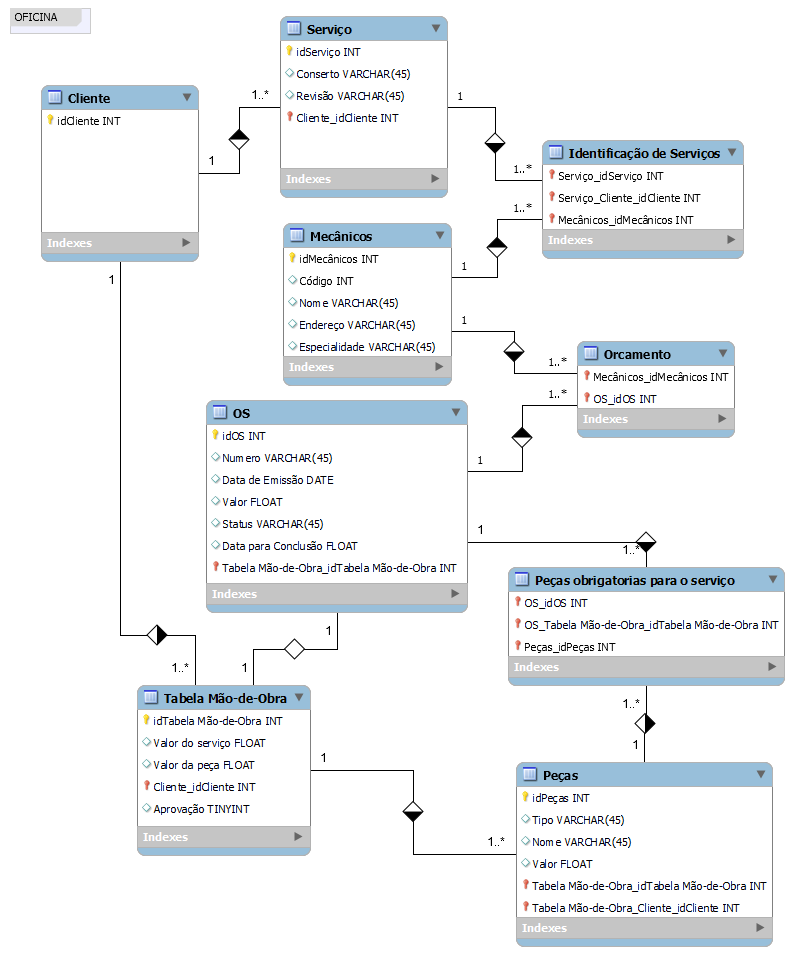

# Sobre o projeto
Esquema de banco de dados para controle e gerenciamento de execução de ordens de serviço em uma oficina mecânica. Desenvolvido no treinamento Database Experience da DIO.

### Escopo

- Controle e gerenciamento de execução de ordens de serviço

### Narrativa
- Clientes levam veiculos à oficina mecânica para serem consertados ou para passarem por revisões periódicas.
- Cada veículo é designado a uma equipe de mecânicos que identifica os serviços a serem executados e preenche uma OS com data de entrega.
- A partir da OS, calcula-se uma tabela de referencia de mão-de-obra.
- O valor de cada peça também irá compor a OS.
- O cliente autoriza a execução dos serviços.
- A mesma equipe avalia a executa os serviços.
- Os mecânicos possuem código, nome, endereço e especialidade.
- Cada OS possui: nº, data de emissão, um valor, status e uma data para conclusão dos trabalhos.
- Uma OS pode ser composta por vários serviços e um mesmo serviço pode estar contido em mais de uma OS.
- Uma OS pode ter vários tipos de peça e uma peça pode estar presente em mais de uma OS.

### Esquema

