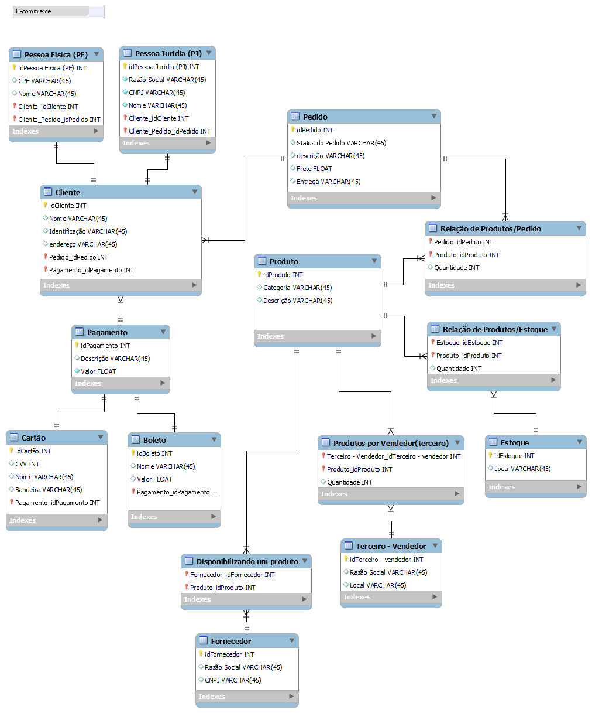

## Sobre o projeto
Esquema de banco de dados para um E-commerce

### Escopo

- Venda de Produtos
- Os produtos são vendidos por uma única plataforma online. Contudo, estes podem ter vendedores distintos (terceiros)
- Cada produto possui um fornecedor
- Um ou mais produtos podem compor um pedido

### Esquema

